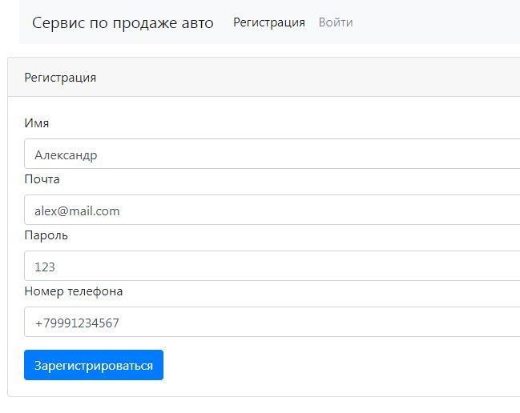
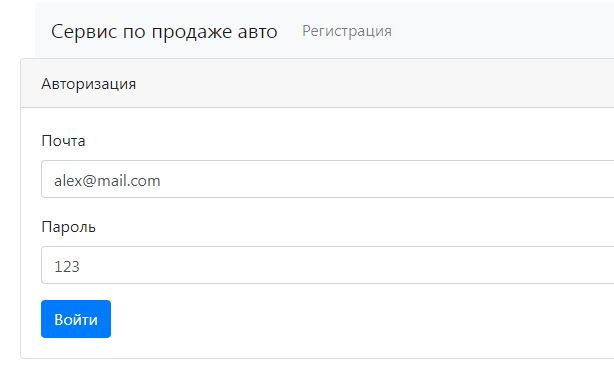
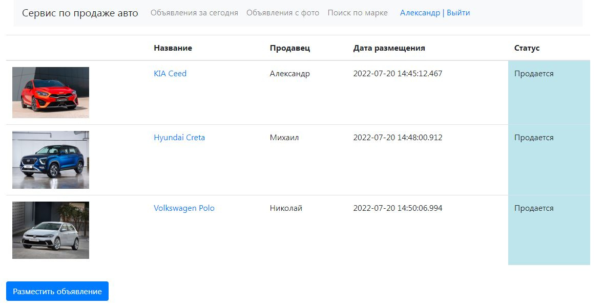
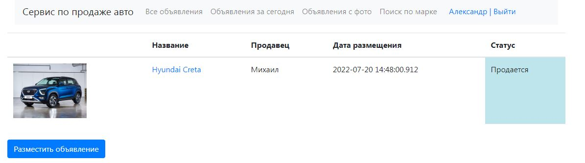
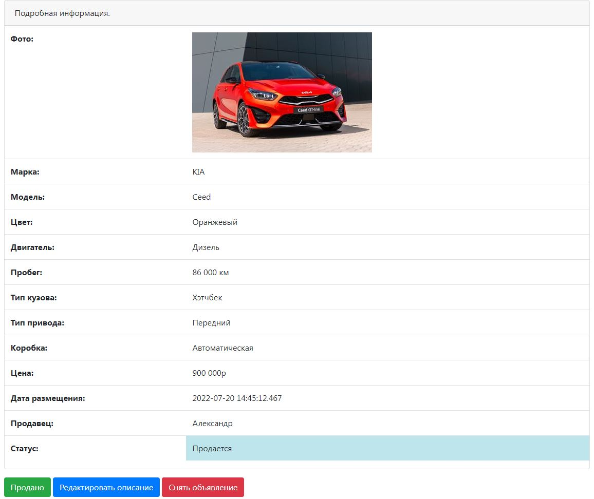
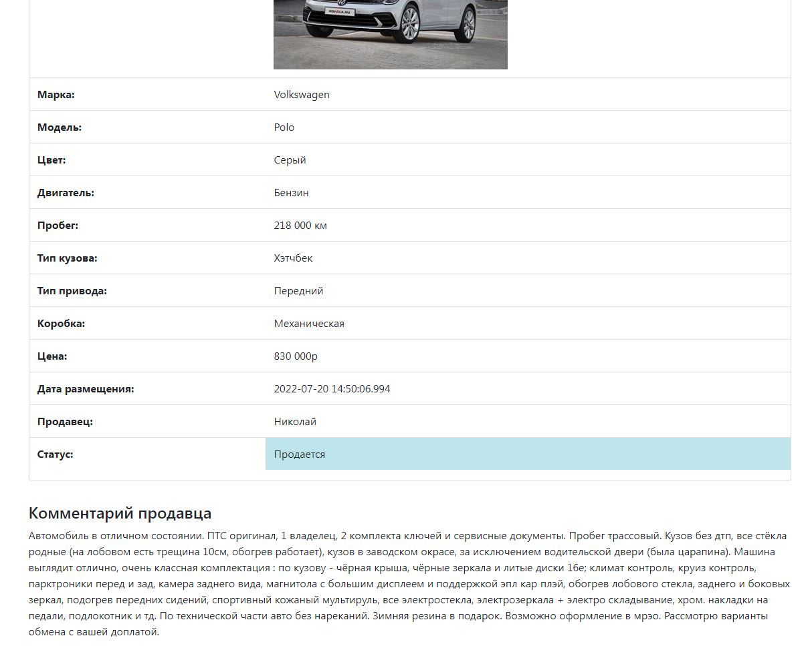
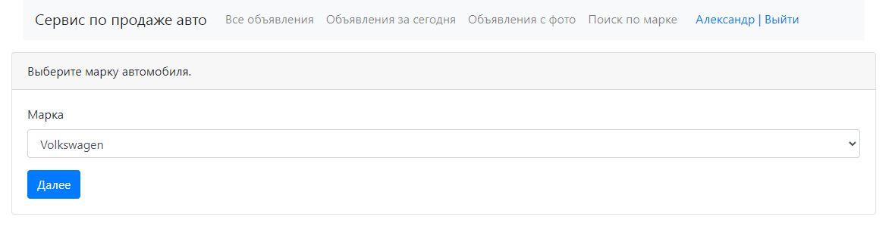
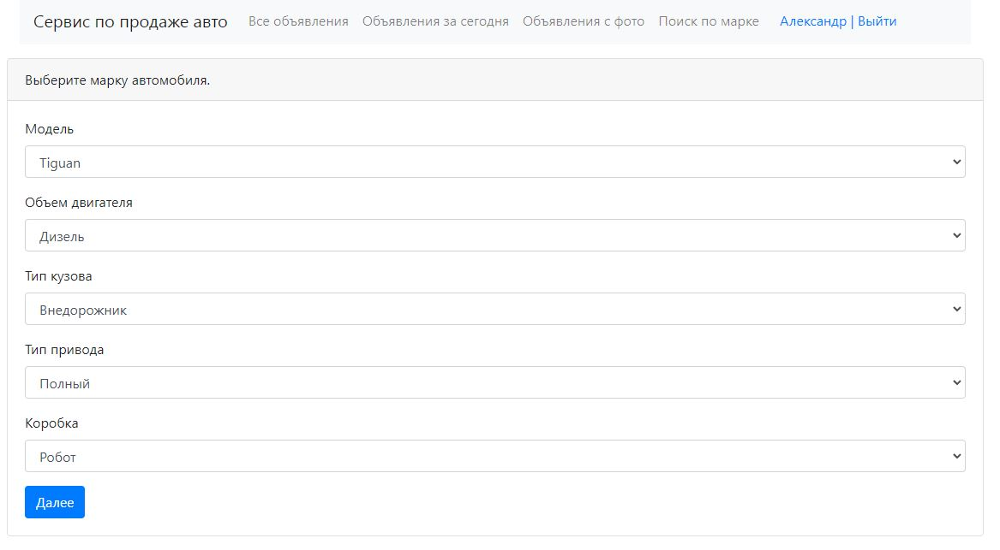
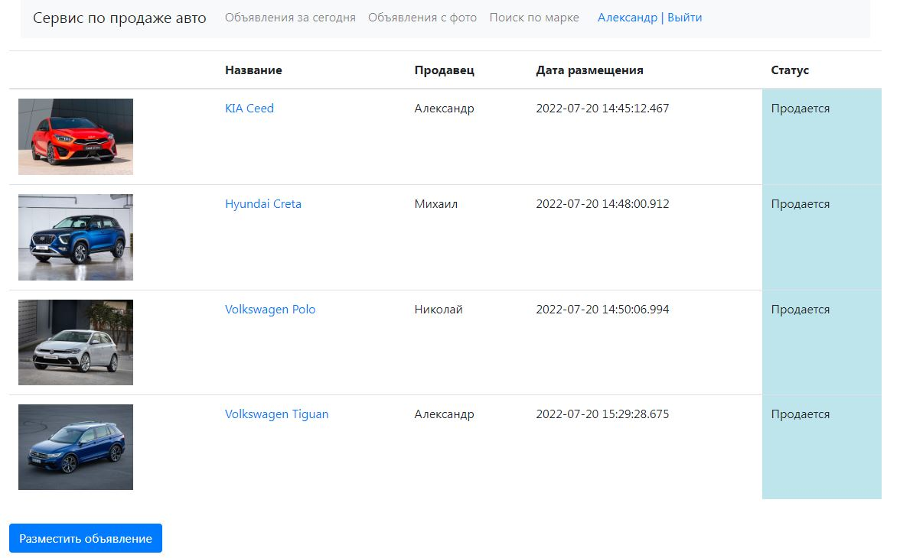
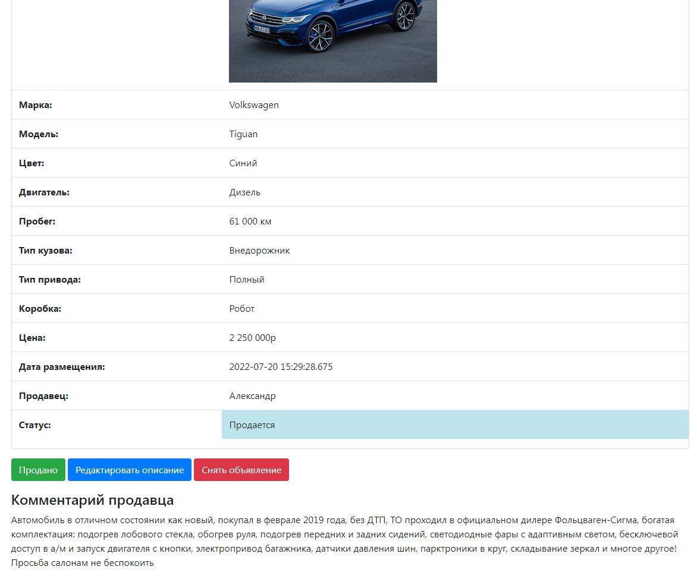

# Проект - "Сервис по продаже автомобилей"

Проект разработан с целью улучшения навыков работы с различными стеками технологий 
и представляет собой веб сервис по продаже автомобилей.
При необходимости функционал проекта можно расширить.

Сервис представляет собой список объявлений. В объявлениях содержится:

- Описание;
- Марка автомобиля;
- Модель;
- Тип кузова;
- Коробка;
- Пробег;
- Цвет;
- Цена;
- Фото.

Объявления имеют статус продано или нет. Сменить статус объявления и отредактировать детали может
только пользователь, который разместил конкретное объявление.

## Запуск проекта

Для корректной работы приложения необходимо установить следующие программы:

- Java 16 или выше;
- PostgreSQL 14 или выше;
- Apache Maven 3.8.3 или выше.

1. Настройка postgreSQL. В терминале набрать следующие команды:

- Ввести логин. Вместо username указать свой;
```bash
  psql --username <username>
```
- Ввести пароль;
- Создать базу данных.
```bash
  create database cars;
```

2. Запуск при помощи maven. В терминале набрать следующие команды:
```
  mvn spring-boot:run
```

При необходимости запустить liquibase для создания таблиц в БД.
```
  mvn liquibase:update
```

## Пример функционирования площадки.

### 1. Регистрация/Авторизация пользователя:

<details>
  <summary>Пример:</summary>
  
  
</details>

### 2. Страница со списком всех объявлений:

<details>
  <summary>Пример:</summary>
  
</details>

Список содержит краткую информацию. Марка, модель авто, имя продавца, дата размещения. Для 
подробной информации необходимо нажать на название объявления.
Объявления можно отфильтровать по наличию фотографии, по марке авто или только новые объявления.

<details>
  <summary>Пример поиска по марке:</summary>
  
</details>

### 3. Детальная информация:

<details>
  <summary>Пример:</summary>
  
  
</details>

Пользователь, который разместил объявление может сменить статус и отредактировать информацию, а 
так же снять объявление.

### 4. Размещение объявления:

<details>
  <summary>Пример:</summary>
  
  
  
  
  
</details>

## Технологии

[](https://www.java.com/)
[](https://maven.apache.org/)
[](https://spring.io/projects/spring-boot)
[](https://www.postgresql.org/)
